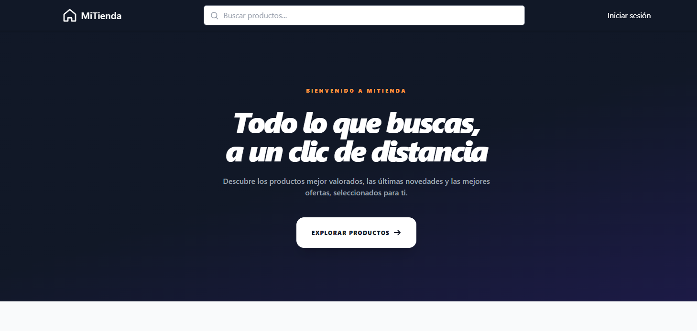
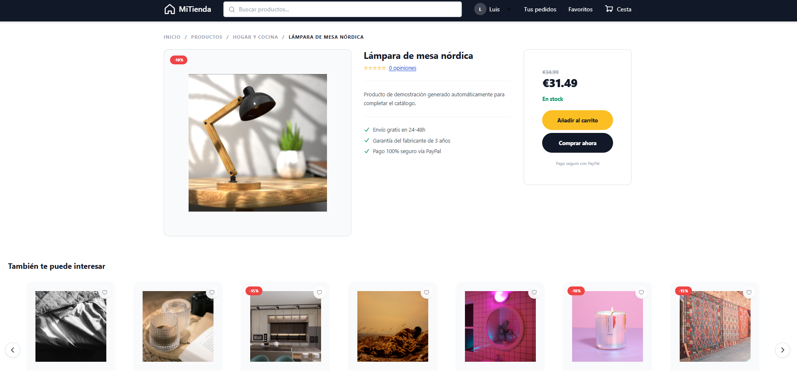
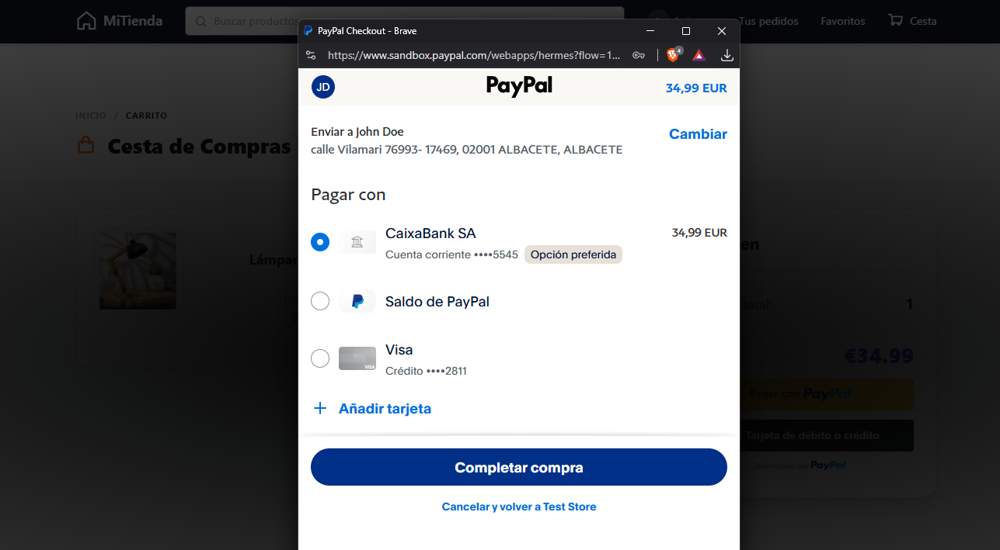
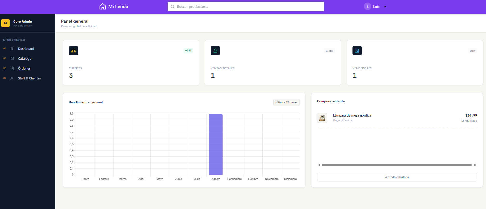
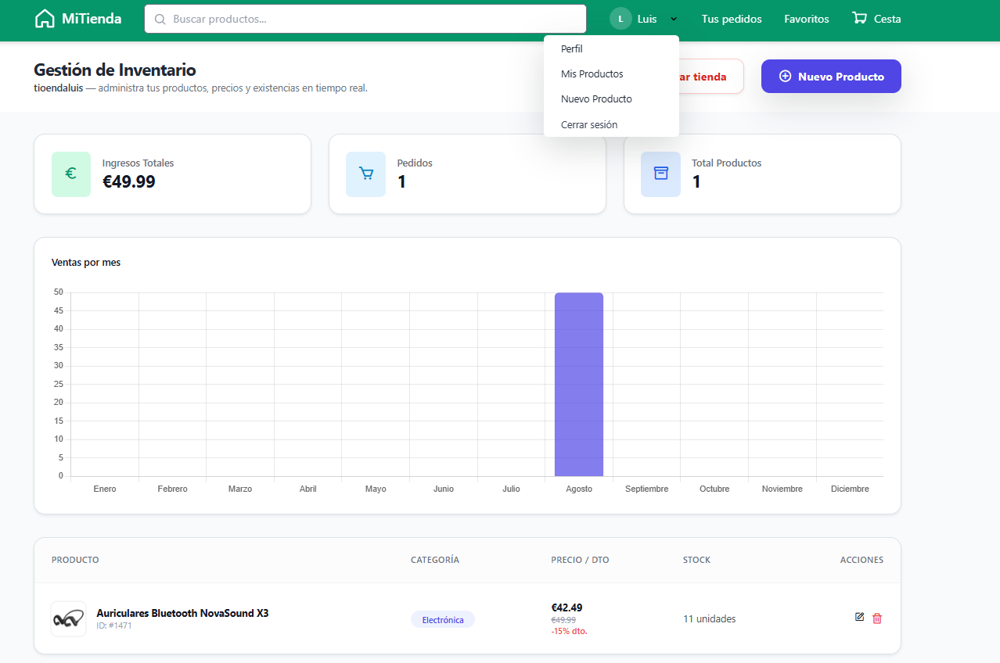

# MiTienda

Tienda online full stack desarrollada desde cero como proyecto personal, con Laravel y PHP en el backend y Blade, Tailwind CSS y JavaScript en el frontend. Incluye tres tipos de usuario (cliente, vendedor y administrador), pago real integrado con PayPal, y está desplegada en producción con dominio propio.

**Demo en producción:** [https://luis-market.es/](https://luis-market.es/)

## Índice

- [Capturas](#capturas)
- [Cuentas de prueba](#cuentas-de-prueba)
- [Funcionalidades](#funcionalidades)
- [Tecnologías utilizadas](#tecnologías-utilizadas)
- [Instalación en local](#instalación-en-local)
- [Autor](#autor)

## Capturas

| Inicio | Detalle de producto |
|---|---|
|  |  |

| Pago con PayPal | Panel de administrador |
|---|---|
|  |  |

| Panel del vendedor |
|---|
|  |

## Cuentas de prueba

Puedes probar la demo en producción con estas cuentas:

| Rol | Email | Contraseña |
|---|---|---|
| Cliente | `cliente@gmail.com` | `cliente123` |
| Vendedor | `vendedor@gmail.com` | `vendedor123` |
| Administrador | `admin@gmail.com` | `admin123` |

El pago se procesa con el entorno sandbox/developer de PayPal (no se cobra dinero real). Puedes usar esta cuenta de comprador de pruebas al finalizar el checkout:

- Email: `sb-bekoy26268524@business.example.com`
- Contraseña: `/S6/7qhN`


## Funcionalidades

### Cliente
- Catálogo de productos con búsqueda, filtros (categoría, precio, valoración mínima) y favoritos.
- Carrito de compra, checkout y pago real con PayPal (modo developer/sandbox).
- Historial de pedidos y sistema de reseñas y valoraciones por producto.
- Registro y perfil de usuario con datos de envío.

### Vendedor
- Alta como vendedor desde la propia web, con nombre de empresa/tienda propio.
- Gestión de productos: crear, editar y eliminar, con imagen incluida.
- Panel con ingresos totales, número de pedidos y gráfico de ventas mensuales.
- Opción de cerrar la tienda (elimina los productos y vuelve a rol de cliente, sin borrar la cuenta).

### Administrador
- Dashboard con estadísticas globales (clientes, ventas, vendedores) y gráfico de ventas por mes.
- Gestión de todo el catálogo de la tienda (de todos los vendedores), pedidos (con detalle y cambio de estado) y usuarios.
- Navegación interna sin recargar la página, usando AJAX.
- Los administradores no pueden editar ni eliminar a otros administradores, ni borrar su propia cuenta, por seguridad.

## Tecnologías utilizadas

**Backend:** PHP, Laravel (Eloquent, migraciones, middleware, validación, autenticación con roles), MySQL.

**Frontend:** Blade, Tailwind CSS, JavaScript (fetch/AJAX), Alpine.js.

**Pagos:** PayPal SDK.

**Herramientas y despliegue:** Git, GitHub, Docker (Laravel Sail), despliegue en producción en Railway con dominio propio.

## Instalación en local

Requiere Docker.

```bash
git clone https://github.com/luisjj12/portfolio.git
cd portfolio
cp .env.example .env
./vendor/bin/sail up -d
./vendor/bin/sail artisan key:generate
./vendor/bin/sail artisan migrate
./vendor/bin/sail artisan storage:link
```

La web quedará disponible en `http://localhost`.

## Autor

**Luis Alfredo Jiménez Jerez**
Técnico Superior en Desarrollo de Aplicaciones Web

- Web: [https://luis-market.es/](https://luis-market.es/)
- GitHub: [github.com/luisjj12](https://github.com/luisjj12)
- Email: luisjmnz122@gmail.com
